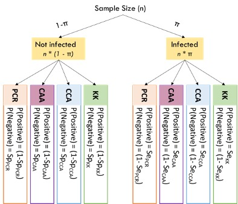
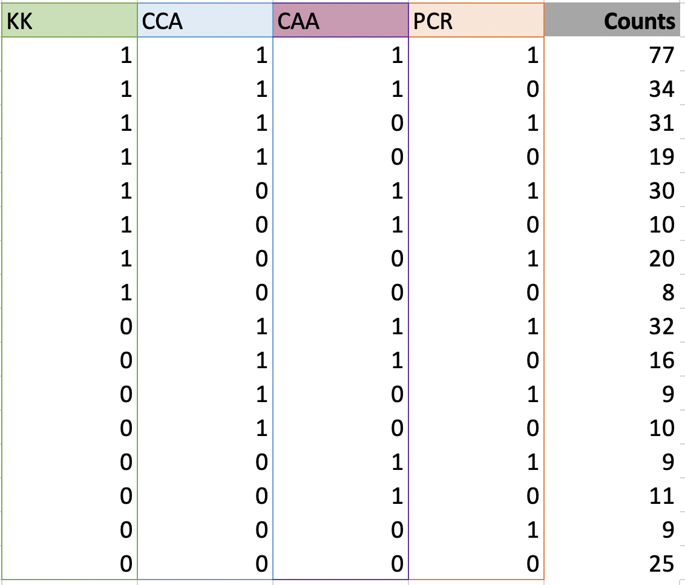
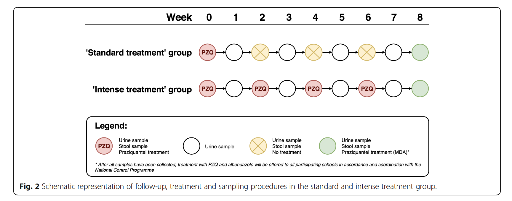

```{r setup, include=FALSE}
knitr::opts_chunk$set(echo = TRUE)
knitr::opts_knit$set(root.dir = '../')
```

## Study description
Schistosomiasis is a parasitic disease mainly prevalent in Sub-Saharan Africa. It is caused by the parasitic worm *Schistosoma* nesting in the human body. The current project focuses on the species *Schistosoma mansoni*.

The WHO-recommended gold standard for the diagnosis of *Schistosoma mansoni* in humans is the detection of parasite eggs in stool samples through microscopy using the Kato-Katz technique. The advantage of the Kato-Katz method is that the rate of false positive results is extremely low because a trained expert can unequivocally identify eggs in the sample. However, especially when the load of parasites is low, there is a chance that no eggs are detected with the microscope method, thus leading to false negative results. In other words, the microscopy method tends to result in high levels of specificity with somewhat lower levels of sensitivity. Thus, previous studies investigating the effectiveness of treatments for *Schistosoma mansoni* infections using microscopy diagnosis might have overestimated the cure rates due to false negative results.

The department of parasitology at the Leiden University Medical Center developed a sensitive new diagnostic test for schistosomiasis based on the CAA (circulating anodic antigen) method. To test the application of the method in the field, it was incorporated in a clinical trial on the efficiency of repeated treatment of praziquantel for schistosomiasis (RePST study). The participants of the study were school children (age 5-15) who were selected because they showed positive results on two tests for schistosomiasis: a rapid field test on urine and the stool microscopy method. Upon study entry, participants were randomly assigned one out of two treatment groups. The first group received one praziquantel treatment, the second group received four treatments at two week intervals. The study included repeated tests for schistosomiasis with four diagnostic methods:

- Stool Microscopy (Kato-Katz method)
- Rapid antigen detection test in urine samples (point-of-care circulating cathodic antigen test)
- CAA in urine samples
- Polymerase chain reaction (PCR) on stool samples

Measurements based on stool samples were repeated during treatment weeks (weeks 0, 2, 4, 6). Measurements based on urine samples were repeated every week. It can be expected that the rate of true positive testing results decreases and the rate of true negative testing results increases due to the medication participants received.

## Research question
The goal of the current project is to assess the accuracy of each of the four tests used in the clinical trial. The challenge is that none of the methods yields a perfect diagnosis. Therefore, the accuracy needs to be estimated from the data. In previous research, Latent Class Analysis has been used to answer this question.

## Estimating Test Sensitivity and Specificity through Latent Class Analysis

### A Simple Model
The goal of the study is to estimate the sensitivity and specificity of all four tests at each measurement occasion. We do this using Latent Class Analysis (LCA), a statistical modeling technique that can infer test sensitivity and specificity as well as disease prevalence from the test result patterns observed in the data. Below, we show a depiction of the simplest version of an LCA model (figure adapted from [Helman et al. (2019)](https://doi.org/10.1002/ece3.6448).



The model starts by assuming that study participants can either be infected (with probability $\pi$ equivalent to the disease prevalence) or not infected (with probability $1-\pi$). For each test, the conditional probability to observe a positive test result if a person is infected, $\text{P(Positive} \mid \text{Infected})$, is equal to the sensitivity of the test. The conditional probability to observe a negative test result if a person is infected is equal to one minus the test sensitivity. If a person is healthy, the conditional probability of obtaining a negative result is equal to the specificity of the test and the probability to obtain a positive result is one minus the specificity, respectively.

In the data, we can for each person observe a positive or a negative result on each test in the test set. This results in $2^k$ test patterns, where $k$ is the number of tests. For four tests, we can therefore observe 16 unique patterns of test results. The table below shows all test result patterns, coding a positive result as 1, and a negative result as 0. Note that the result patterns imply an ordering of tests: A pattern of 1000 indicates that a positive result was obtained in the first test, and negative results on test 2, 3, and 4. In the table, the test ordering is KK-CCA-CAA-PCR, such that a pattern of 1000 indicates a positive test result on KK, and negative test results on CCA, CAA, and PCR. The ordering of tests (i.e., columns in the table) is arbitrary, but should be kept in mind when interpreting the results of the LCA.

{width=33%}

For each of the patterns, we can count how many study participants followed the pattern. For example, in the table above, 9 participants showed the pattern 0001, that is, a positive result on PCR, and a negative result on all other tests. By combining this data table and the model described above, LCA can provide estimates for the test sensitivities and specificities, as well as for the prevalence.

### Model Extensions
The model described above can be applied to all measurement occasions of the current study where all four diagnostic methods for *Schistosoma Mansoni* infections are applied, that is, the measurements obtained in week 2, 4, 6, and 8 of the study (see study design chart below). Note that the model should *not* be applied to the baseline measurement because here participant selection depended on test results in the KK and CCA method, hence the test result patterns are not indicative of the specificity and sensitivity of the tests. The study design as well as the characteristics of the test introduce additional complexity that should be taken into account when estimating the sensitivity and specificity of the tests. We will introduce these below.

{width=70%}

#### Trace Results
In the CCA method, test results categorized as positive, negative, or trace results. The latter category contains results that are ambiguous with respect to the disease status. With LCA requiring dichotomous test outcomes, trace results need to be classified as positive or negative. Depending on this decision, the counts for obtained test patterns will change, and so will the estimates of test sensitivity and specificity. It is therefore sensible to repeat all analyses for trace-positive and trace-negative classifications to obtain an estimate for CCA test characteristics in both cases, and to check the robustness of other estimates towards the CAA result classification.

#### Treatment Group
In the current research design, participants are randomly assigned to one out of two treatment groups. They either obtain one dose of praziquantel at baseline or four doses at two-week intervals. According to the study protocol registration ([Hoekstra et al., 2018](https://doi.org/10.1186/s12879-018-3554-2)), it can be expected that the cure rate in the multiple dose regimen is higher than the cure rate in the single dose regimen. Therefore, it can be expected that the disease prevalence in the multiple dose regimen group is lower than in the single dose regimen. The difference in prevalence between treatment groups can be introduced as a parameter into the LCA model.

#### Dependence Between Tests
The simple model is based on the assumption of *conditional independence*. This means that the probability to obtain a certain test result pattern, say, 1100, is only dependent on the prevalence, as well as on the sensitivity and specificity of the tests. In other words, if we know that a person obtained a positive result in test 1, this does not give us any additional information about their probability to obtain a positive result in test 2. However, in practice, this is a strong assumption that might not hold in practice.

Let us imagine for a second that the first two tests are identical, i.e., the results of the first test for each individual were copied to obtain the result of test 2. Then a positive result in the first test would perfectly predict a positive result in the second test, no matter what the underlying test sensitivity or specificity of test are. Of course, in practice, nobody would copy test results. However, two tests can similar to one another independent of their sensitivity and specificity. For example, two tests might be based on a similar procedure due to which participants who had an infection in the past are more likely to obtain positive results on the present test independent of their present disease status. For any participant who had been infected in the past, these two tests will have more similar results than either of the two tests and a third test that is not influenced by past disease status.

In mathematical terms, conditional (in)dependence can be described in terms of (non-)equivalence of conditional probabilities. If conditional independence holds,

$$
\text{P(Positive Test 2} \mid \text{Infected} \cap \text{Positive Test 1}) = \text{P(Positive Test 2} \mid \text{Infected} \cap \text{Negative Test 1}) 
$$
$$
\text{P(Negative Test 2} \mid \text{Healthy} \cap \text{Positive Test 1}) = \text{P(Negative Test 2} \mid \text{Healthy} \cap \text{Negative Test 1}) 
$$

If tests are conditional dependent, but this is not accounted for in the statistical model, the estimates of sensitivity and specificity can be biased (see also: [Gardner et al., 2000](https://doi.org/10.1016/S0167-5877(00)00119-7), [Berkvens et al. 2006](https://doi.org/10.1097/01.ede.0000198422.64801.8d)). However, introducing parameters for conditional dependence among all tests renders the model unidentifiable because there are too many parameters and too few degrees of freedom. For example, for four tests, there are 31 parameters that need to be estimated if we allow for dependence between all tests, but there are only 15 degrees of freedom in the data (16 counts for different patterns, but we know the final count if we know the first 15). Therefore, if we want to allow for dependence between the tests, we need to impose additional constraints on the model. For example, we can set the specificity of some of the tests to one or only allow for dependence between two models.

## Statistical Analyses

### A General Remark on Bayesian Modeling
Following the article by [Clements et al. (2018)](https://doi.org/10.1186/s13071-018-2700-4), we estimate the sensitivity and specificity of the tests in the Bayesian framework. For an accessible introduction to Bayesian analyses, see [Wagenmakers et al. (2018)](https://doi.org/10.3758/s13423-017-1343-3). In Bayesian parameter estimation, uncertainty about a parameter (e.g., the specificity of the KK method) is represented in a probability distribution. The probability density represents the plausibility of parameter values, that is, plausible parameter values have a high probability density whereas implausible values have a low probability density. Wide probability distributions signal a high degree of uncertainty, whereas peaked distributions signal low uncertainty. Uncertainty can also be represented in terms of credible intervals (similar to confidence intervals in frequentist statistics), that is, intervals that indicate the probability with which an unobserved parameter will fall into a certain range. For example, for a 95\% credible interval, the probability that the parameter falls within the defined range is 95\%.

The uncertainty about a parameter value *before* seeing the data is represented in the prior distribution. The uncertainty about a parameter value *after* seeing the data is represented in the posterior distribution. Typically, there is more uncertainty before seeing the data than after seeing the data, so the posterior distribution is more peaked than the prior distribution. To conduct a Bayesian analysis, it is necessary to define prior distributions for all unknown parameters. These prior distributions can either be defined as wide, so-called "uninformed" prior distributions that indicate a maximum uncertainty about the parameter values (here, we use uniform distributions across the range of possible parameter values as uninformed priors, unless specified differently), or they can be specified as so-called "informed" prior distributions that have a (slight) peak on parameter values that are more plausible to begin with. Formulating informed prior distributions has the advantage that the model predictions are constrained to realistic scenarios from the beginning, and that they can make the final estimates more precise. However, with little data, they can also draw the final results towards the values that obtained a high plausibility in the prior distributions, so it is reasonable to check the robustness of the results with respect to the prior distribution when conducting Bayesian Analyses. Here, we use the following informed prior distributions for sensitivity and specificity (if not specified differently):

- SeKK ~ dbeta(1.43, 1.29) (this was also used in Clements et al., 2018)
- SeCCA ~ dbeta(3.05, 1.51) (this was also used in Clements et al., 2018)
- SeCAA ~ dbeta(3.05, 1.51) (this was also used in Clements et al., 2018)
- SePCR ~ dbeta(3.05, 1.51) (this prior is based on private conversation with P. Hoekstra)

- SpKK ~ dbeta(21.2, 2.06) (this was also used in Clements et al., 2018)
- SpCCA ~ dbeta(5.38, 1.49) (this was also used in Clements et al., 2018)
- SpCAA ~ dbeta(21.2, 2.06) (this prior is based on private conversation with P. Hoekstra)
- SpPCR ~ dbeta(21.2, 2.06) (this prior is based on private conversation with P. Hoekstra)

### Data Preparation

#### Required R-Packages
To conduct the analyses, you will need to install several R-packages. This can be done using the following code:

```{r eval=FALSE, results='hide'}
install.packages("R2jags")
install.packages("runjags")
install.packages("MCMCvis")
```

#### A Note On Pseudo-Results
For the analyses described below, we use pseudo-results based on simulated data. When simulated data is replaced with real study data, researchers should double-check that the structure of the data is the same. The simulation function can be loaded using the following code:

```{r results='hide', message=FALSE}
source("./scripts/sim_LCAsimple.R")
```

All models require the data to be in form of a pattern-count table (see figure above). We provide a function that transfers raw data (individual values on each test for each participant) to the pattern-count table.

### Statistical Models and Parameter Estimation

In the following, we will describe how to conduct a Latent Class Analysis for the results of the current study. We propose four models that can account for different aspects of the complexity in the data. As mentioned before, it is impossible to extend the model to accommodate all possible effects because this would increase the number of parameters to an extent that makes it impossible to obtain stable estimates from the data. Therefore, the four models we propose make different assumptions, which we will mention in the model description. Below is an overview of the model assumptions:

- Model 1: No treatment effect, no test dependence (equivalent to the simple model described above)
- Model 2: No dependence between tests, but model allows for a treatment effect
- Model 3: Dependence between two tests, no treatment effect
- Model 4: Dependence between all tests, no treatment effect, specificity of 3 tests fixed to 1

#### Model 1: No treatment effect, no test dependence
Model 1 estimates test sensitivity and specificity based on the assumptions that tests are conditionally independent and that the prevalence does not differ between treatment groups. Note that the model requires the result pattern table to be in the order KK-CCA-CAA-PCR. Check with the structure of the simulated data (`sim`) when replacing the simulated data with the real data. 

Model 1 with flat (uninformed) priors can be fitted using the following code:


```{r results='hide', message=FALSE}
# open jags library
library(R2jags)

# define / read in data
# NOTE: This is simulated data, replace with real data
sim <- sim.LCA(SeKK = 0.7, SeCCA = 0.7, SeCAA = 0.7, SePCR = 0.7,
               SpKK = 0.95, SpCCA = 0.95, SpCAA = 0.95, SpPCR = 0.95,
               prev = 0.9, n = 350)
counts <- sim[,5]
n <- sum(counts)

# define data object that is passed on to JAGS
data <- list("counts", "n")

# define starting values
myinits <-	list(
  list(SeKK = 0.7, SeCCA = 0.7, SeCAA = 0.7, SePCR = 0.7,
       SpKK = 0.8, SpCCA = 0.8, SpCAA = 0.8, SpPCR = 0.8, prev=0.9),
  list(SeKK = 0.6, SeCCA = 0.7, SeCAA = 0.8, SePCR = 0.6,
       SpKK = 0.6, SpCCA = 0.7, SpCAA = 0.5, SpPCR = 0.5, prev=0.8),
  list(SeKK = 0.5, SeCCA = 0.5, SeCAA = 0.5, SePCR = 0.5,
       SpKK = 0.9, SpCCA = 0.9, SpCAA = 0.9, SpPCR = 0.9, prev=0.7),
  list(SeKK = 0.6, SeCCA = 0.6, SeCAA = 0.6, SePCR = 0.6,
       SpKK = 0.8, SpCCA = 0.8, SpCAA = 0.8, SpPCR = 0.8, prev=0.9)
)

# parameters to be monitored
parameters <- c("SeKK", "SeCCA", "SeCAA", "SePCR",
                "SpKK", "SpCCA", "SpCAA", "SpPCR", "prev")

# MCMC
samples <- jags(data, inits=myinits, parameters,
                model.file ="./models/LCA_simple_flatPriors.txt", n.chains=4, n.iter=10000,
                n.burnin=2000, n.thin=1, DIC=F)

```

__Convergence Diagnostics__

The posterior distributions for LCA models cannot be calculated analytically. Therefore, the fitting algorithm uses a sampling procedure (MCMC sampling) to draw samples from the posterior distribution. These samples can then be used to get information about the posterior distribution (e.g., distribution quantiles). Before we look at the posterior distributions, we first need to take a look at the samples themselves to check whether the MCMC sampling procedure worked (some more information on MCMC diagnostics can be found [here](https://jrnold.github.io/bayesian_notes/mcmc-diagnostics.html)). This is to make sure that the samples are actually draws from the posterior distribution, statistically speaking, that the MCMC algorithm "converged". The following tests are therefore also called "convergence diagnostics".

First, we need to make sure that there is no autocorrelation between the samples. We can check this visually by inspecting so-called trace plots (see below). The trace plots should look like a "hairy caterpillar", i.e., you should not see any "mountains" or "valleys" in the plot, just something like white noise.

```{r}
library(MCMCvis)
MCMCtrace(samples, type="trace", ind=TRUE, pdf=FALSE)
```

Second, we take a look at the so-called R-hat values. To understand this value, it is first important to know that the algorithm that draws samples from the posterior distribution depends on starting values. Starting values can be chosen arbitrarily, and if the procedure converges, the resulting posterior distribution should not be dependent on the values with which the algorithm started sampling. The R-hat value checks for this by comparing the estimates of model parameters within and between independent sampling procedures (these are called "chains"). If the R-hat value is larger than 1.05, this should be considered as a warning (see also [here](https://mc-stan.org/rstan/reference/Rhat.html) for a description of R-hat).

```{r}
samples$BUGSoutput$summary[,"Rhat"]
```

__What to do in case of convergence issues?__

If there are convergence issues, there are a couple of actions that can help to improve convergence. First, if you see that right side of the traceplot looks good, but the left side not, you can discard more samples from the start. This can be done using the `n.burnin` argument in the `jags()` function. For example, you could increase n.burnin from 2000 to 3000 in this case. Second, if there is autocorrelation throughout the chain, you can only look at every second, third, forth, etc. sampled parameter value. This can be done using the `n.thin` command in the `jags()` function. For example, if `n.thin=10`, the algorithm only uses every tenth sample. Note that both of these actions decrease the number of used samples from which you infer the posterior distribution, so if you increase n.burnin or n.thin, it might be necessary to also increase the parameter `n.iter`, i.e., the overall number of samples drawn. The third action you can take is to adjust the starting values to parameters that are more plausible. However, this requires some knowledge about the posterior distribution and should therefore be done only with care. If nothing helps and the R-hat value for a parameter is still larger than 1.05, the posterior estimates for this parameter should not be interpreted.

__Obtaining Parameter Estimates from the Posterior Distribution__

In Bayesian statistical models, all information about the parameter estimates is contained in the posterior distribution. To get a first impression of the posterior distributions, it is sensible to plot them first (see below).

```{r}
MCMCtrace(samples, type="density", ind=TRUE, pdf=FALSE, ISB=FALSE)
```

We can see one posterior distribution for each parameter. Looking at the posterior distributions gives us an idea about the (a)symmetry of the distribution and about good ways to summarize the posterior. For example, an often-reported value is the mean of the posterior distribution, but for a highly asymmetric distribution it might also be relevant to report the median or mode.

```{r}
MCMCplot(samples)
```

The next plot (see above) shows the posterior means and 95\% credible intervals for each parameter. The width of the credible interval indicates the uncertainty about the paramter estimate.

Finally, we can take a look at a table that summarizes the characteristics of the posterior distributions:

```{r}
print(samples)
```

The table shows for each parameter the mean (mu.vect), the standard deviation (sd.vect), as well as five quantiles of the posterior distribution. It also contains the R-hat value and an effective sample size for convergence diagnostics (this is related to the samples from the posterior distribution, *not* the number of participants in the study).

__Model 1 with informed priors__

Model 1 with informed priors can be fitted using the same code as before, but replacing the `model.file` argument with `"./models/LCA_simple_informedPriors.txt"`. 

#### Model 2: Treatment Effect Model

Model 2 includes a parameter that accommodates the treatment effect, i.e, the two treatment groups are allowed to differ in this model. The data needs to be in the format of one result pattern table per group, using the same order of tests as before (KK-CCA-CAA-PCR). Double-check with the simulated data `group1sim` and `group2sim` whether the real data was preprocessed properly before running the analysis with the real data. The model can be fitted using the following code:

```{r setup2, include=FALSE}
knitr::opts_chunk$set(echo = TRUE)
knitr::opts_knit$set(root.dir = '../')
```

```{r results='hide', message=FALSE}
# Source helpers.
source("./scripts/helpers/helpers.R")

# define / read in data
# NOTE: This is simulated data, replace with real data
group1sim <- sim.LCA(SeKK = 0.7, SeCCA = 0.7, SeCAA = 0.7, SePCR = 0.7,
                     SpKK = 0.95, SpCCA = 0.95, SpCAA = 0.95, SpPCR = 0.95,
                     prev = 0.9, n = 350)
group2sim <- sim.LCA(SeKK = 0.7, SeCCA = 0.7, SeCAA = 0.7, SePCR = 0.7,
                     SpKK = 0.95, SpCCA = 0.95, SpCAA = 0.95, SpPCR = 0.95,
                     prev = 0.8, n = 350)
counts <- matrix(c(group1sim$counts, group2sim$counts), nrow=2, byrow=TRUE)
n1 <- sum(counts[1,])
n2 <- sum(counts[2,])

# define data object that is passed on to JAGS
data <- list("counts", "n1", "n2")

# define starting values for chains
myinits <-	list(
  list(SeKK = 0.7, SeCCA = 0.7, SeCAA = 0.7, SePCR = 0.7,
       SpKK = 0.8, SpCCA = 0.8, SpCAA = 0.8, SpPCR = 0.8, genprev=0.9, diff=0.1),
  list(SeKK = 0.7, SeCCA = 0.6, SeCAA = 0.6, SePCR = 0.6,
       SpKK = 0.5, SpCCA = 0.5, SpCAA = 0.5, SpPCR = 0.5, genprev=0.8, diff=0.01),
  list(SeKK = 0.6, SeCCA = 0.7, SeCAA = 0.7, SePCR = 0.7,
       SpKK = 0.9, SpCCA = 0.9, SpCAA = 0.9, SpPCR = 0.9, genprev=0.7, diff=0.2),
  list(SeKK = 0.6, SeCCA = 0.6, SeCAA = 0.6, SePCR = 0.6,
       SpKK = 0.8, SpCCA = 0.8, SpCAA = 0.8, SpPCR = 0.8, genprev=0.9, diff=0.05)
)

# parameters to be monitored
parameters <- c("SeKK", "SeCCA", "SeCAA", "SePCR",
                "SpKK", "SpCCA", "SpCAA", "SpPCR", "genprev", "diff")

# MCMC
samples <- jags(data, inits=myinits, parameters,
                model.file ="./models/LCA_simple_treatment_flatPriors.txt", n.chains=4, n.iter=10000,
                n.burnin=3000, n.thin=1, DIC=F)
```

The estimated parameters of Model 2 are the same as the ones for Model 1, with the exception of "genprev" and "diff". The parameter "genprev" gives an estimate for the average prevalence across treatment groups ((prevalence_group1+prevalence_group2)/2). The parameter "diff" estimates the difference between treatment group prevalences (prevalence_group1-prevalence_group2). Note that a negative difference implies that the prevalence in group 2 is larger than in group 1. Other than this, diagnostics and interpretation for Model 2 works exactly like for Model 1, as can be seen below.

__Convergence Diagnostics__

Convergence diagnostics for Model 2 can be determined using the code below. Please refer to the convergence diagnostics section of Model 1 for an interpretation of the output.

```{r}
MCMCtrace(samples, type="trace", ind=TRUE, pdf=FALSE)
samples$BUGSoutput$summary[,"Rhat"]
```

__Obtaining Parameter Estimates from the Posterior Distribution__

Parameter estimates from the posterior distribution can be obtained using the code below. Please refer to the parallel section of Model 1 for an interpretation of the output.

```{r}
MCMCtrace(samples, type="density", ind=TRUE, pdf=FALSE, ISB=FALSE)
MCMCplot(samples)
print(samples)
```

__Model 2 with Informed Priors__

Model 1 with informed priors can be fitted using the same code as before, but replacing the `model.file` argument with `"./models/LCA_simple_treatment_informedPriors.txt"`. 

#### Model 3: Dependency between two tests

Model 3 allows for two tests being conditionally dependent. It always assumes that the dependent models are the first two columns in your result pattern table. For example, if your result pattern table looks like the one below, the dependent tests are KK and CCA.

```{r}
sim
```

If you want to change the order of the tests in your result pattern table to allow different tests to be dependent, __USE THE FUNCTION MIHAI CREATED AS SHOWN BELOW__ . We recommend running Model 3 with all different combinations of tests (6 combinations overall) and check the robustness of sensitivity and specificity estimates to the test dependency.

The model can be fitted using the following code:

```{r results='hide', message=FALSE}
# Source helpers.
source("./scripts/helpers/helpers.R")

# define / read in data
# NOTE: This is simulated data, replace with real data
sim <- sim.LCA(SeKK = 0.7, SeCCA = 0.7, SeCAA = 0.7, SePCR = 0.7,
                     SpKK = 0.95, SpCCA = 0.95, SpCAA = 0.95, SpPCR = 0.95,
                     prev = 0.9, n = 350)
counts <- sim[,5]
n <- sum(counts)

# define data object that is passed on to JAGS
data <- list("counts", "n")

# define starting values for chains
myinits <-	list(
  list(theta1=0.8, theta2=0.7, theta3=0.9, theta4=0.6, theta5=0.4, theta6=0.7,
       theta7=0.6, theta8=0.7, theta12=0.8, theta16=0.7, theta24=0.9),
  list(theta1=0.9, theta2=0.6, theta3=0.8, theta4=0.5, theta5=0.5, theta6=0.8,
       theta7=0.7, theta8=0.8, theta12=0.9, theta16=0.5, theta24=0.8),
  list(theta1=0.5, theta2=0.8, theta3=0.7, theta4=0.7, theta5=0.7, theta6=0.5,
       theta7=0.5, theta8=0.7, theta12=0.6, theta16=0.6, theta24=0.7),
  list(theta1=0.7, theta2=0.5, theta3=0.8, theta4=0.8, theta5=0.6, theta6=0.6,
       theta7=0.4, theta8=0.6, theta12=0.5, theta16=0.4, theta24=0.6)
)

# parameters to be monitored
parameters <- c("prev", "Se1", "Sp1", "Se2", "Sp2", "Se3", "Sp3", "Se4", "Sp4")

# MCMC
samples <- jags(data, inits=myinits, parameters,
                model.file ="./models/LCA_dependent_2Tests.txt", n.chains=4, n.iter=15000,
                n.burnin=5000, n.thin=1, DIC=F)
```

__Model Parameters__

As mentioned earlier, the conditional dependence model requires more parameters than the models assuming conditional independence. We used a different parametrization to fit the conditional dependence models, containing 31 parameters in total, some of which are constrained or not estimated depending on the imposed constraints (for an explanation of the parametrization, see [Berkvens et al. 2006](https://doi.org/10.1097/01.ede.0000198422.64801.8d)). For example, in Model 2, we impose the constraint that only two models are dependent. This reduces the number of parameters to 11 free parameters. The file ".docs/ParameterOverview.pdf" contains an overview of all parameters in the full model as well as of the effects of constraints in Model 3 and Model 4. It also explains how posteriors for sensitivity, specificity, and prevalence are computed from the model parameters. The prior distributions used in Models 3 and 4 are uninformed prior distributions because we did not have the time to elicit prior knowledge about the parameter values from the substantive experts in the project. The file ".scripts/LCA_dependent_full.txt" contains the full model with all 31 parameters which can be adapted if different constraints should be applied based on experts' prior knowledge.

__Convergence Diagnostics__

Convergence diagnostics for Model 3 can be determined using the code below. Please refer to the convergence diagnostics section of Model 1 for an interpretation of the output.

```{r}
MCMCtrace(samples, type="trace", ind=TRUE, pdf=FALSE)
samples$BUGSoutput$summary[,"Rhat"]
```

__Obtaining Parameter Estimates from the Posterior Distribution__

Parameter estimates from the posterior distribution can be obtained using the code below. Please refer to the parallel section of Model 1 for an interpretation of the output.

```{r}
MCMCtrace(samples, type="density", ind=TRUE, pdf=FALSE, ISB=FALSE)
MCMCplot(samples)
print(samples)
```

#### Model 4: Conditional Dependence Between All Tests

Model 4 allows for conditional dependence between all tests. To make this model identifiable, we constrain the specificity of the first three tests in the result pattern table to be equal to 1. Additionally, we impose mild probabilistic constraints through the prior distributions: We impose a Beta(3.05, 1.51) prior on estimates of sensitivity, constrain the sum of sensitivity and specificity of Test 4 to be larger than 1, and constrain the prevalence to lie between values of [1/n, 1-1/n] to avoid that the sampling gets stuck at the limits of the parameter space.

The interpretation of parameters in Model 4 is analogue to Model 3, and a list of all model parameters can be found in the document "./docs/ParameterOverview.pdf". Model 4 can be fitted using the following code:

```{r results='hide', message=FALSE}
# Source helpers.
source("./scripts/helpers/helpers.R")

# define / read in data
# NOTE: This is simulated data, replace with real data
sim <- sim.LCA(SeKK = 0.7, SeCCA = 0.7, SeCAA = 0.7, SePCR = 0.7,
                     SpKK = 1, SpCCA = 1, SpCAA = 1, SpPCR = 0.8,
                     prev = 0.9, n = 150)
counts <- sim[,5]
n <- sum(counts)

# define data object that is passed on to JAGS
data <- list("counts", "n") 

# define starting values for chains
myinits <-	list(
  list(theta1=0.9, theta2=0.6, theta4=0.5, theta5=0.5,
       theta8=0.8, theta9=0.8, theta10=0.7, theta11=0.7, theta16=0.5, 
       theta17=0.7, theta18=0.7, theta19=0.7, theta20=0.7, theta21=0.7,
       theta22=0.7, theta23=0.7, theta24=0.8),
  list(theta1=0.8, theta2=0.5, theta4=0.6, theta5=0.7,
       theta8=0.5, theta9=0.6, theta10=0.7, theta11=0.7, theta16=0.5, 
       theta17=0.9, theta18=0.8, theta19=0.6, theta20=0.5, theta21=0.5,
       theta22=0.9, theta23=0.7, theta24=0.9),
  list(theta1=0.7, theta2=0.7, theta4=0.7, theta5=0.4,
       theta8=0.7, theta9=0.7, theta10=0.7, theta11=0.7, theta16=0.5, 
       theta17=0.7, theta18=0.6, theta19=0.8, theta20=0.6, theta21=0.8,
       theta22=0.7, theta23=0.8, theta24=0.7),
  list(theta1=0.5, theta2=0.8, theta4=0.8, theta5=0.8,
       theta8=0.7, theta9=0.5, theta10=0.5, theta11=0.5, theta16=0.5, 
       theta17=0.5, theta18=0.5, theta19=0.5, theta20=0.5, theta21=0.5,
       theta22=0.5, theta23=0.5, theta24=0.5)
) 

# parameters to be monitored
parameters <- c("prev", "Se1", "Se2", "Se3", "Se4", "Sp4")

# MCMC
samples <- jags(data, inits=myinits, parameters,
                model.file ="./models/LCA_dependent_Spec123Is1.txt", n.chains=4, n.iter=100000, 
                n.burnin=3000, n.thin=20, DIC=F)

```

__Convergence Diagnostics__

Convergence diagnostics for Model 4 can be determined using the code below. Please refer to the convergence diagnostics section of Model 1 for an interpretation of the output.

```{r}
MCMCtrace(samples, type="trace", ind=TRUE, pdf=FALSE)
samples$BUGSoutput$summary[,"Rhat"]
```

__Obtaining Parameter Estimates from the Posterior Distribution__

Parameter estimates from the posterior distribution can be obtained using the code below. Please refer to the parallel section of Model 1 for an interpretation of the output.

```{r}
MCMCtrace(samples, type="density", ind=TRUE, pdf=FALSE, ISB=FALSE)
MCMCplot(samples)
print(samples)
```

