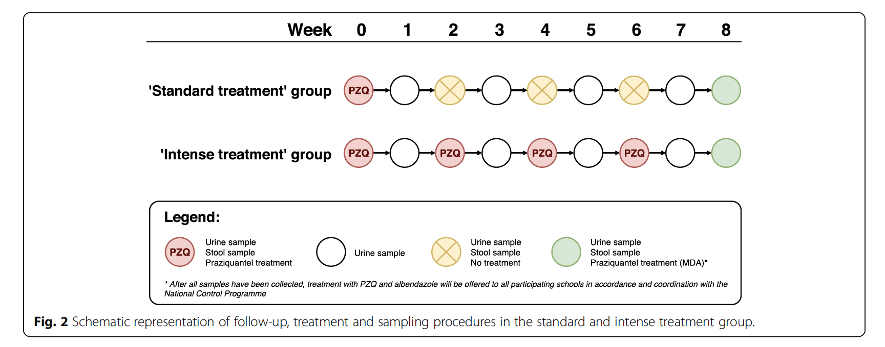

```{r setup, include=FALSE}
knitr::opts_chunk$set(echo = TRUE)
```

## Estimating Test Sensitivity and Specificity through Latent Class Analysis

### A Simple Model
The goal of the study is to estimate the sensitivity and specificity of all four tests at each measurement occasion. We do this using Latent Class Analysis (LCA), a statistical modeling technique that can infer test sensitivity and specificity as well as disease prevalence from the test result patterns observed in the data. Below, we show a depiction of the simplest version of an LCA model (figure adapted from [Helman et al. (2019)](https://doi.org/10.1002/ece3.6448).


The model starts by assuming that study participants can either be infected (with probability $\pi$ equivalent to the disease prevalence) or not infected (with probability $1-\pi$). For each test, the conditional probability to observe a positive test result if a person is infected, $\text{P(Positive} \mid \text{Infected})$, is equal to the sensitivity of the test. The conditional probability to observe a negative test result if a person is infected is equal to one minus the test sensitivity. If a person is healthy, the conditional probability of obtaining a negative result is equal to the specificity of the test and the probability to obtain a positive result is one minus the specificity, respectively.

In the data, we can for each person observe a positive or a negative result on each test in the test set. This results in $2^k$ test patterns, where $k$ is the number of tests. For four tests, we can therefore observe 16 unique patterns of test results. The table below shows all test result patterns, coding a positive result as 1, and a negative result as 0. Note that the result patterns imply an ordering of tests: A pattern of 1000 indicates that a positive result was obtained in the first test, and negative results on test 2, 3, and 4. In the table, the test ordering is KK-CCA-CAA-PCR, such that a pattern of 1000 indicates a positive test result on KK, and negative test results on CCA, CAA, and PCR. The ordering of tests (i.e., columns in the table) is arbitrary, but should be kept in mind when interpreting the results of the LCA.

{width=33%}

For each of the patterns, we can count how many study participants followed the pattern. For example, in the table above, 9 participants showed the pattern 0001, that is, a positive result on PCR, and a negative result on all other tests. By combining this data table and the model described above, LCA can provide estimates for the test sensitivities and specificities, as well as for the prevalence.

### Model Extensions
The model described above can be applied to all measurement occasions of the current study where all four diagnostic methods for *Schistosoma Mansoni* infections are applied, that is, the measurements obtained in week 2, 4, 6, and 8 of the study (see study design chart below). Note that the model should *not* be applied to the baseline measurement because here participant selection depended on test results in the KK and CCA method, hence the test result patterns are not indicative of the specificity and sensitivity of the tests. The study design as well as the characteristics of the test introduce additional complexity that should be taken into account when estimating the sensitivity and specificity of the tests. We will introduce these below.

{width=70%}

#### Trace Results
In the CCA method, test results categorized as positive, negative, or trace results. The latter category contains results that are ambiguous with respect to the disease status. With LCA requiring dichotomous test outcomes, trace results need to be classified as positive or negative. Depending on this decision, the counts for obtained test patterns will change, and so will the estimates of test sensitivity and specificity. It is therefore sensible to repeat all analyses for trace-positive and trace-negative classifications to obtain an estimate for CCA test characteristics in both cases, and to check the robustness of other estimates towards the CAA result classification.

#### Treatment Group
In the current research design, participants are randomly assigned to one out of two treatment groups. They either obtain one dose of praziquantel at baseline or four doses at two-week intervals. According to the study protocol registration ([Hoekstra et al., 2018](https://doi.org/10.1186/s12879-018-3554-2)), it can be expected that the cure rate in the multiple dose regimen is higher than the cure rate in the single dose regimen. Therefore, it can be expected that the disease prevalence in the multiple dose regimen group is lower than in the single dose regimen. The difference in prevalence between treatment groups can be introduced as a parameter into the LCA model.

#### Dependence Between Tests
The simple model is based on the assumption of *conditional independence*. This means that the probability to obtain a certain test result pattern, say, 1100, is only dependent on the prevalence, as well as on the sensitivity and specificity of the tests. In other words, if we know that a person obtained a positive result in test 1, this does not give us any additional information about their probability to obtain a positive result in test 2. However, in practice, this is a strong assumption that might not hold in practice.

Let us imagine for a second that the first two tests are identical, i.e., the results of the first test for each individual were copied to obtain the result of test 2. Then a positive result in the first test would perfectly predict a positive result in the second test, no matter what the underlying test sensitivity or specificity of test are. Of course, in practice, nobody would copy test results. However, two tests can similar to one another independent of their sensitivity and specificity. For example, two tests might be based on a similar procedure due to which participants who had an infection in the past are more likely to obtain positive results on the present test independent of their present disease status. For any participant who had been infected in the past, these two tests will have more similar results than either of the two tests and a third test that is not influenced by past disease status.

In mathematical terms, conditional (in)dependence can be described in terms of (non-)equivalence of conditional probabilities. If conditional independence holds,

$$
\text{P(Positive Test 2} \mid \text{Infected} \cap \text{Positive Test 1}) = \text{P(Positive Test 2} \mid \text{Infected} \cap \text{Negative Test 1}) 
$$
$$
\text{P(Negative Test 2} \mid \text{Healthy} \cap \text{Positive Test 1}) = \text{P(Negative Test 2} \mid \text{Healthy} \cap \text{Negative Test 1}) 
$$

If tests are conditional dependent, but this is not accounted for in the statistical model, the estimates of sensitivity and specificity can be biased (see also: [Gardner et al., 2000](https://doi.org/10.1016/S0167-5877(00)00119-7), [Berkvens et al. 2006](https://doi.org/10.1097/01.ede.0000198422.64801.8d)). However, introducing parameters for conditional dependence among all tests renders the model unidentifiable because there are too many parameters and too few degrees of freedom. For example, for four tests, there are 31 parameters that need to be estimated if we allow for dependence between all tests, but there are only 15 degrees of freedom in the data (16 counts for different patterns, but we know the final count if we know the first 15). Therefore, if we want to allow for dependence between the tests, we need to impose additional constraints on the model. For example, we can set the specificity of some of the tests to one or only allow for dependence between two models.

### Data Analysis

In the following, we will describe how to conduct a Latent Class Analysis for the results of the current study. We propose four models that can account for different aspects of the complexity in the data. As mentioned before, it is impossible to extend the model to accommodate all possible effects because this would increase the number of parameters to an extent that makes it impossible to obtain stable estimates from the data.


```{r}
```
